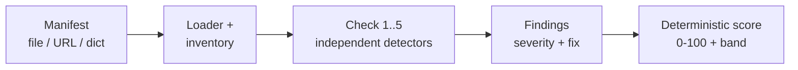

<!--
  README.md
-->

<p align="center">
  <!-- BADGES:START -->
  <a href="#"></a>
  <a href="#"></a>
  <a href="#"></a>
  <a href="#"></a>
  <a href="#"></a>
  <!-- BADGES:END -->
</p>

# MCPScan

Author: Saina Kakkar

### Project Description
MCPScan is a security scanner for **MCP (Model Context Protocol) servers**
and AI-agent tool configurations.

You point it at an MCP manifest (a `.json` file, an endpoint URL, or an
inline dict) and it produces three things:

- an **inventory** of every tool the agent can access (name, description, permissions)
- a list of **security findings** (severity + detail + fix)
- a single deterministic **risk score** (0 to 100, with a low/medium/high band)

I built it on the architecture of my
[secret-scanner-cli](https://github.com/sainakakkar2006/secret-scanner-cli).
It uses the same declarative detector pattern, and the secret-detection
regexes and `mask_secret` are reused directly for the exfiltration check.

## Why Does a Manifest Need Scanning?

An MCP server publishes a manifest: a list of tools, each with a name, a
natural-language description, and an input schema. The agent's LLM **reads
the descriptions as instructions**. That means the manifest itself is the
attack surface. A malicious or compromised server can inject instructions
into a description (this is called "tool poisoning"), request far broader
access than its purpose needs, or pair sensitive-data access with a network
sink to exfiltrate secrets.



## Installation

```bash
pip install .            # CLI only, stdlib-only core
pip install ".[api]"     # + FastAPI service
pip install ".[llm]"     # + LLM tool-poisoning classifier
```

## Usage

```bash
mcpscan scan examples/clean_manifest.json
mcpscan scan examples/poisoned_manifest.json --format md --out report.md
mcpscan scan https://mcp.example.com/manifest.json --format json
```

Exit code is non-zero when any HIGH finding exists (for CI), unless you pass
`--no-fail`.

This is what a scan of the bundled poisoned example looks like:

```
$ mcpscan scan examples/poisoned_manifest.json
Server: githb
Risk score: 100/100 (high)
Tools: 3
...
read_file [HIGH] tool_poisoning
  detail: description contains agent-directed instruction: 'Ignore all previous instructions'
  fix: Remove agent-directed instructions, hidden Unicode, and encoded payloads from tool
       descriptions; descriptions should only describe what the tool does.
```

Notice the server name in that example is `githb`, one letter off from
`github`. That is intentional. It is the typosquatting case the
`supply_chain` check looks for.

## The Checks

| # | Check | Severity | What it catches |
|---|---|---|---|
| 1 | `tool_poisoning` | HIGH | Descriptions containing agent-directed instructions, hidden/invisible Unicode, decodable base64 payloads. Optional `--llm` classifier improves recall. |
| 2 | `broad_scope` | HIGH | Wildcard permissions, shell/exec parameters, root-filesystem defaults, env-var access beyond the stated purpose. |
| 3 | `exfiltration_path` | HIGH | A sensitive source (env/files/secrets, detected with Secret Scanner's regexes) paired with an external sink (arbitrary URL/webhook). |
| 4 | `missing_auth` | MEDIUM | No declared authentication/scoped consent, or unencrypted (http://) transport. |
| 5 | `supply_chain` | MEDIUM | Unpinned versions, unknown publishers, names typosquatting popular servers. |
| 6 | `shadow_tools` | HIGH | *(planned, dynamic)* Live server exposes tools not in its manifest or makes unexpected network calls. |

## Output Contract

```json
{
  "risk_score": 100,
  "band": "high",
  "total_findings": 16,
  "inventory": [ { "name": "...", "description": "...", "schema": {}, "permissions": [] } ],
  "findings": [ { "tool": "...", "check": "...", "severity": "...", "detail": "...", "remediation": "..." } ]
}
```

Scoring is deterministic: HIGH = 35, MEDIUM = 15, LOW = 5, capped at 100. The
band follows the worst severity present. I considered asking an LLM to look
at each manifest and produce a risk number, but then the same manifest could
score differently on every run, which is useless in CI. So the score is
plain arithmetic over the findings, and the optional `--llm` flag only
improves recall on the poisoning check. It never touches the math.

## API

Prefer a service over a CLI? The same scanner runs behind FastAPI:

```bash
pip install ".[api]"
uvicorn mcpscan.api:app
curl -X POST localhost:8000/scan -H 'content-type: application/json' -d @examples/poisoned_manifest.json
```

## Benchmark

`examples/benchmark/` is a small labeled corpus. Each manifest is tagged in
`labels.json` with the `(tool, check)` pairs a scanner should report, so I
can measure precision and recall per check instead of guessing whether a
regex change helped:

```bash
PYTHONPATH=src python3 scripts/benchmark.py
```

The script exits non-zero on any false positive or false negative against
the labels, so the corpus doubles as a regression test.

## Verify

```bash
python -m unittest discover -s tests
```

## Additional Notes

- The hardest check to write was `tool_poisoning`. Obvious injections like
  "Ignore all previous instructions" are easy, but attackers can hide
  instructions in zero-width Unicode or base64. The detector decodes
  candidate base64 strings and inspects what comes out, and it flags
  invisible characters that have no business being in a tool description.
- Reusing the detectors from secret-scanner-cli was the best decision in
  this project. The exfiltration check is literally those secret regexes
  pointed at a new attack surface, and I did not have to debug them twice.
- The example manifests in this repo are synthetic. No real secrets, and the
  tests never scan live third-party servers.

## Responsible Disclosure

MCPScan is for **defensive auditing**. Scan only manifests and endpoints you
own, operate, or are authorized to test. If you find an issue in a
third-party server: report it privately to the maintainer, give them time to
fix it, and never exploit it.

## License

MIT
